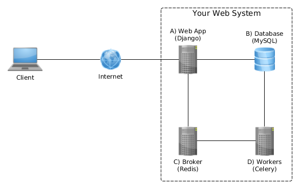

# N-tier Architecture with Python

This is an example of n-tier (multitier) client-server architecture. If you are interested in how to build a web system with database, broker and workers running on seperate machines, with Python, to perform and manage periodic tasks, this is it!

#### What am I exactly talking about?

Let's assume we want to create a web system that:

- is scalable,
- allows manage tasks,
- allows manage periodic tasks,
- and performs these tasks asynchronously on separate server.

With Python we can use these technologies:

- [Django](https://www.djangoproject.com/) framework for web app,
- [MySQL](https://www.mysql.com/) database for web app and task scheduler,
- [Redis](http://redis.io/) as message broker,
- and [Celery](http://www.celeryproject.org/) for tasks execution.

Just look at this graph:

To build and test the architecture we can use [Virtualbox](https://www.virtualbox.org/).

## How to do it?

1. Download and install [Virtualbox](https://www.virtualbox.org/).
2. Download [Ubuntu Server 14.04 LTS](http://releases.ubuntu.com/14.04/).
3. Run Virtualbox and create 4 machines (serverA, serverB, serverC, serverD) with Linux Ubuntu 64-bit, 512 MB RAM, 8GB disk space (fixed).
4. Make sure that each machine has access to the Internet and the Virtual Optical Disk File is set to Ubuntu Server .iso file.
5. Install Ubuntu Server (then update and upgrade it) on each machine.
6. On each machine install these dependencies:

        sudo apt install python-dev python3-dev libmysqlclient-dev gcc git

7. On each machine install [pip](https://pip.pypa.io/en/stable/):

        wget https://bootstrap.pypa.io/get-pip.py
        sudo python3 get-pip.py

8. On serverA:

        git clone https://github.com/DominikMagdalenski/ntier_arch_py.git
        cd ntier_arch_py
        sudo pip install virtualenv
        virtualenv env -p /usr/bin/python3
        source env/bin/activate
        pip install -r requirements.txt

9. Shutdown serverA.
10. On serverB:

        sudo apt install mysql-server
        sudo mysql_secure_installation
        sudo vim /etc/mysql/my.cnf
            comment out this line in /etc/mysql/my.cnf:
                #bind-address        = 127.0.0.1

11. Shutdown serverB.
12. On serverC:

        wget http://download.redis.io/releases/redis-3.2.3.tar.gz
        tar -xzf redis-3.2.3.tar.gz
        sudo apt install make
        cd redis-3.2.3
        make
        vim redis.conf
            comment out this line in redis.conf:
                #bind 127.0.0.1
            and add this line:
                bind 0.0.0.0

13. Shutdown serverC.
14. On serverD:

        git clone https://github.com/DominikMagdalenski/ntier_arch_py.git
        cd ntier_arch_py
        sudo pip install virtualenv
        virtualenv env -p /usr/bin/python3
        source env/bin/activate
        pip install -r requirements.txt

15. Shutdown serverD.
16. Set Network Adapter2 on serverA virtual machine to Internal Network.
17. Set Network Adapter1 on serverB, serverC, serverD virtual machine to Internal Network.
18. Start all virtual machines.
19. On serverA:

        sudo ifconfig eth1 10.0.2.1 netmask 255.255.255.248

20. On serverB:

        sudo ifconfig eth0 10.0.2.2 netmask 255.255.255.248

21. On serverC:

        sudo ifconfig eth0 10.0.2.3 netmask 255.255.255.248

22. On serverD:

        sudo ifconfig eth0 10.0.2.4 netmask 255.255.255.248

23. On serverB:

        mysql -u root -p
            CREATE DATABASE django CHARACTER SET utf8;
            GRANT ALL PRIVILEGES ON django.* TO 'django'@'10.0.2.1' IDENTIFIED BY 'django';
            GRANT ALL PRIVILEGES ON django.* TO 'django'@'10.0.2.4' IDENTIFIED BY 'django';
            exit;

24. On server A:

        cd ntier_arch_py
        source env/bin/activate
        vim ntier_arch_py/settings.py
            set proper BROKER_URL:
                BROKER_URL = 'redis://10.0.2.3:6379/0'
            set proper HOST in DATABASES hash:
                DATABASES = {
                    'default': {
                        (...)
                        'HOST': '10.0.2.2',
                        (...)
                    }
                }
        python manage.py migrate
        python manage.py createsuperuser

25. On serverC:

        cd redis-3.2.3
        src/redis-server redis.conf

26. On serverD:

        cd ntier_arch_py
        source env/bin/activate
        vim ntier_arch_py/settings.py
            set proper BROKER_URL:
                BROKER_URL = 'redis://10.0.2.3:6379/0'
            set proper HOST in DATABASES hash:
                DATABASES = {
                    'default': {
                        (...)
                        'HOST': '10.0.2.2',
                        (...)
                    }
                }
        celery worker -A ntier_arch_py -l info -B

27. On serverA, figure out what eth0's IP is (ifconfig) and run Django server:

        python manage.py runserver 0.0.0.0:8000

28. Let's suppose the serverA eth0's IP is 192.168.0.25. Now, when each server is properly configured, start a web browser on your host machine (the real one) and go to [192.168.0.25:8000/admin/](192.168.0.25:8000/admin/). Log in with creadentials that you have entered creating superuser.

29. Now, you can create Tasks and Periodic Tasks in the Django administration panel, and see the results of the tasks on serverD terminal (Celery).

## Please do not use the configurations on your production! This is just an example for educational purposes.

TODO:

- serverE with MongoDB for tasks results.